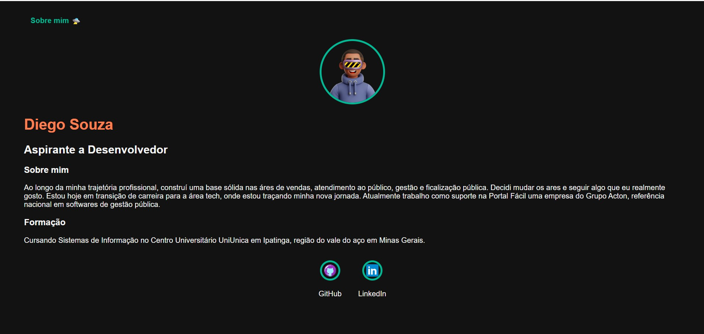

Este é um site simples e responsivo criado para **fixação de conceitos de HTML e CSS**.

---

## 🎯 Objetivos do Projeto

- Praticar **HTML** e boas práticas de acessibilidade.
- Aplicar conceitos de **CSS**.
- Criar um portfólio simples.

---

## 🧱 Tecnologias Utilizadas

- **HTML5** – Estruturação semântica do conteúdo.
- **CSS3** – Estilização, layout responsivo e animações.
- **Design Responsivo** – Adaptação para mobile, tablet e desktop.
- **Acessibilidade Básica** – Uso de `alt`, `aria-label`, contraste de cores e navegação lógica.

---

## 🖼️ Visual do Projeto

